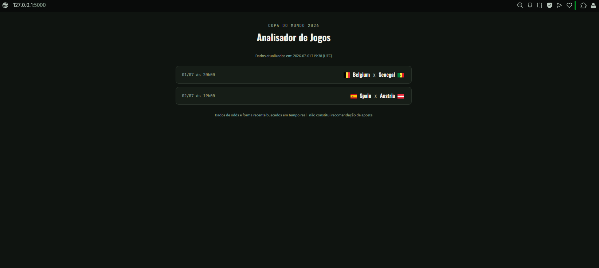
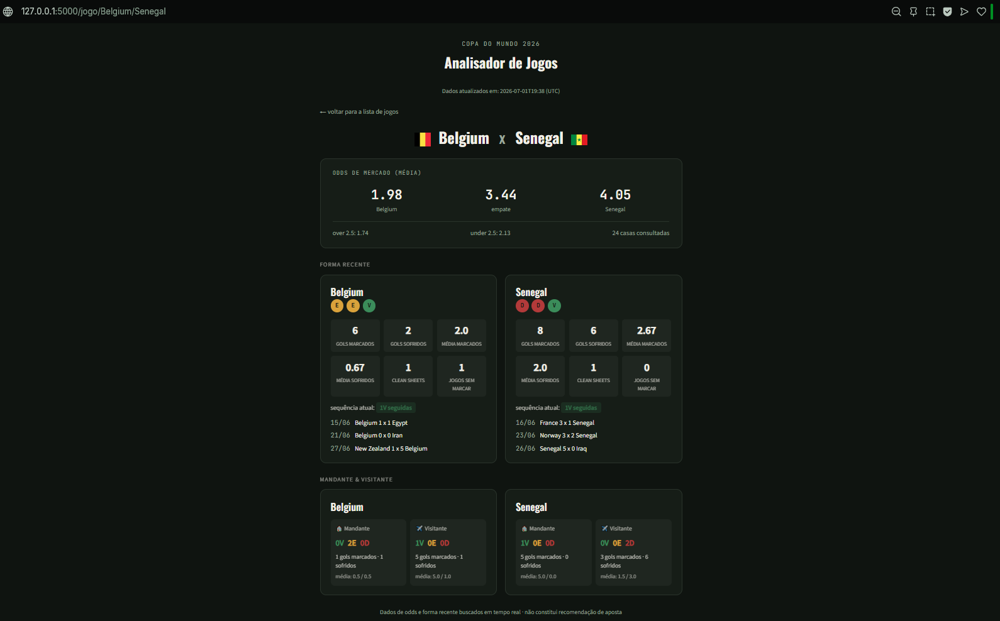

# ⚽ Analisador de Jogos — Copa do Mundo 2026

Aplicação web em Python/Flask para análise de confrontos da Copa do Mundo 2026. Agrega dados de múltiplas APIs, calcula estatísticas e exibe tudo em uma interface limpa — sem frameworks frontend.

---

## 📸 Interface

> Cards de jogos → relatório completo com odds, forma recente, estatísticas e desempenho por mando de campo.




---

## 🧠 O que ele faz

Para cada confronto das próximas horas, o analisador busca e consolida:

- **Odds de mercado** — média entre até 25 casas de apostas (1X2, over/under)
- **Forma recente** — últimos 5 jogos com placar, resultado e competição
- **Estatísticas expandidas** — gols marcados/sofridos, médias, clean sheets, jogos sem marcar, sequência atual
- **Mandante & Visitante** — desempenho separado por mando de campo
- **Head-to-head** — histórico de confrontos diretos entre as seleções

---

## 🔌 APIs utilizadas

| API | Dados | Plano |
|---|---|---|
| [The Odds API](https://the-odds-api.com) | Odds de mercado | Free |
| [football-data.org](https://football-data.org) | Times, forma recente, head-to-head | Free |

---

## 📊 Estatísticas calculadas

Todas calculadas em `domain/estatisticas.py` a partir dos dados brutos — sem depender dos resumos da API, que apresentam inconsistências durante o torneio.

| Estatística | Descrição |
|---|---|
| V / E / D | Contados direto dos resultados, não do resumo da API |
| Gols marcados / sofridos | Total e média por jogo |
| Clean sheets | Jogos sem sofrer gol |
| Jogos sem marcar | Jogos onde o time não marcou |
| Sequência atual | Resultado repetido mais recente (ex: "VVV") |
| Mandante / Visitante | V/E/D e médias separados por mando |

---

## 📁 Dados em cache

```json
{
  "atualizado_em": "2026-07-01T01:06:01Z",
  "janela_horas": 5,
  "jogos": [
    {
      "casa": "Mexico",
      "fora": "Ecuador",
      "odds": { "odd_media_casa": 2.29, "odd_media_empate": 2.78, "..." },
      "forma": {
        "Mexico": {
          "jogos": [ "..." ],
          "stats_gols": { "..." },
          "forma_expandida": { "..." },
          "mando": { "mandante": { "..." }, "visitante": { "..." } }
        }
      }
    }
  ]
}
```

---
